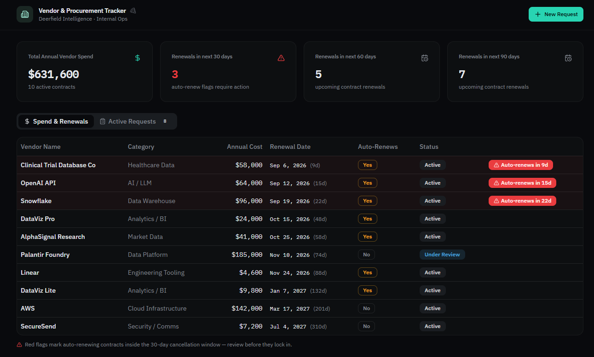
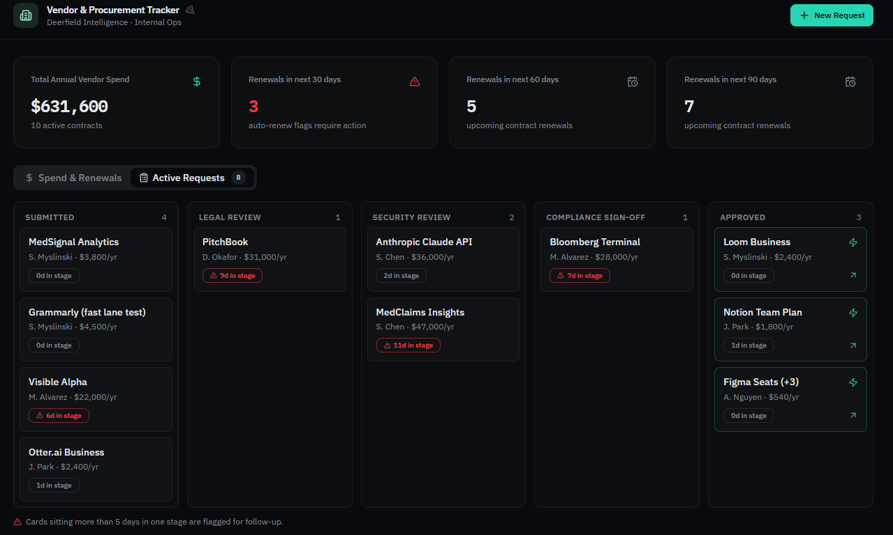
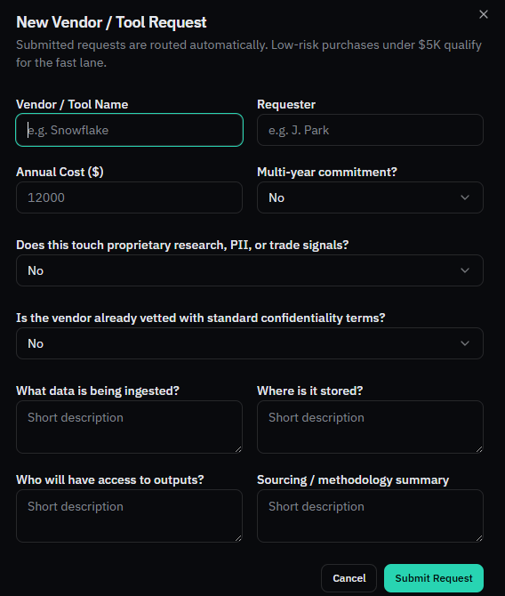
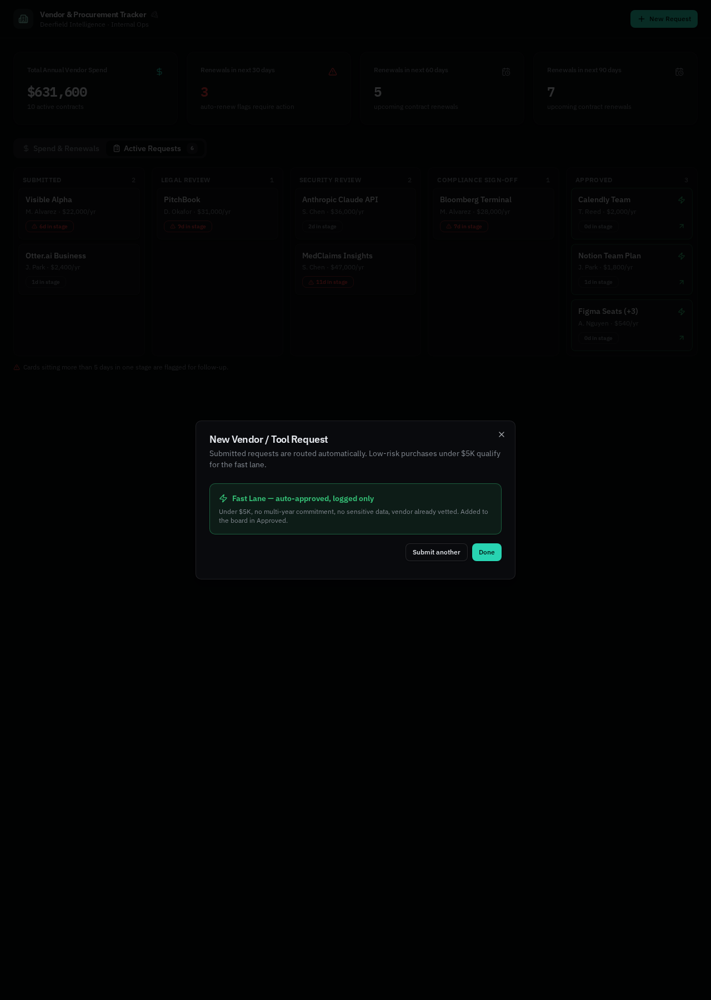

# Prototype: the Vendor & Procurement Tracker

Live preview: https://id-preview--31ecfa10-3501-45bc-8b71-242f641abf0b.lovable.app

Built with Lovable. Informally nicknamed "the Pizza Tracker," a nod to Marcus's own phrase when describing what compliance review visibility was missing, "no dashboard or pizza tracker to see where things are stuck."

## Which gap this addresses

Gap 2 in the gap assessment, vendor and contract procurement visibility, the single most broadly confirmed gap in the whole assessment. All five people interviewed named it independently: David's $40K near miss on an auto renewal, Priya manually coordinating requests across four parties herself, Marcus calling review timing a complete black box, James finding orphaned contracts and duplicate tool spend, and Sarah confirming the real driver of slow reviews is missing documentation, not volume.

## What it does

**Spend & Renewals.** Current vendor contracts sorted by soonest renewal, with a red flag on anything auto renewing within 30 days. Includes a deliberate duplicate spend example, two overlapping data visualization tools, pulled directly from James's story about paying for three similar tools at once because nobody was coordinating.

**Active Requests.** A 5 stage board, Submitted through Legal Review, Security Review, Compliance Sign-off, and Approved, with anything sitting more than 5 days in a stage flagged. This is Sarah's black box complaint made visible.

**New Request intake, with real fast lane logic.** Two gates have to pass for a request to auto approve rather than route to full review: James's threshold, under $5,000 annually and not a multi year commitment, and Sarah's data sensitivity gate, no proprietary research, no PII, not used for trade signals, and a vendor with already vetted confidentiality terms. The intake also requires the exact documentation fields Sarah asked for on the live biotech pilot review, what data is being ingested, where it is stored, and who has access to the outputs, since she was explicit that missing documentation, not volume, is what turns a three day review into a three week one.

## Note on scope

Hiring pipeline speed ranked above this gap once David made his own tie breaking call between the two. This was still the right prototype to build: he named the vendor tracker directly, unprompted, as the artifact he would point to as evidence of success, and it is the more software native problem of the two, the hiring fix is mostly ownership and process, not something a dashboard solves. A hiring or offer momentum tracker is the clear next build with more time.
